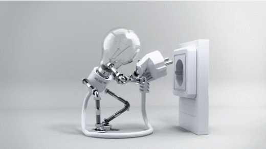
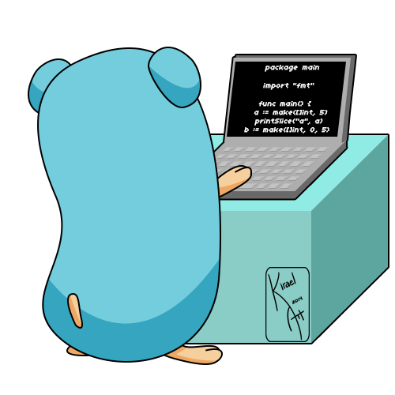

# GitHub Profile README

```md
# 💫 About Me:

<p align="center">
  
</p>

<h3 align="center">
Welcome to my GitHub Profile 👋 <br>
I'm MD. AWADHE HOSSAIN
</h3>

🚀 I love exploring new technologies and solving real-world problems.

💡 Feel free to ask any questions about programming, robotics, AI, or academics.

---

## 🔭 Currently Working On

- Body Following Drone
- Face Detection and Object Tracking
- Self Balancing Bot
- Line Follower Robot

<p align="center">
  
</p>

---

## 🌱 Currently Learning

- Digital Image Processing
- Advanced Data Structures & Algorithms
- Machine Learning Fundamentals
- TensorFlow
- Python (Intermediate)
- Scikit-Learn

<p align="center">
  
</p>

---

## 🎓 Education

<p align="center">
  
</p>

### United International University (UIU)
**B.Sc. in Computer Science and Engineering**  
September 2023 - Present

### Dhaka Residential Model College (DRMC)
**Higher Secondary Certificate (HSC)**  
2020 - 2022

---

## 💼 Experience & Academic Skills

<p align="center">
  
</p>

- Calculus and Algebra
- Statistics
- Coordinate Geometry & Vector
- Digital Logic Design
- Soccer Bot Development
- Linear Programming
- Computer Architecture

---

## 📜 Certifications

### HackerRank - Problem Solving (Basic)

[View Certificate](https://www.hackerrank.com/certificates/iframe/def654eea39f)

---

## 🚀 Problem Solving Profiles

- HackerRank: https://www.hackerrank.com/profile/mdawadhehossain
- LeetCode: https://leetcode.com/u/awadhehossain
- Codeforces: https://codeforces.com/profile/mdawadhehossain
- CodeChef: https://www.codechef.com/users/awadhe

<p align="center">
  
</p>

---

## 🌐 Connect With Me

- Behance: https://behance.net/awadhehossain
- Facebook: https://facebook.com/paraffin67
- Instagram: https://instagram.com/paraffin67
- Reddit: https://reddit.com/user/Budget_Web_928
- X (Twitter): https://x.com/hossainawadhe
- YouTube: https://youtube.com/@Awadhehossain

---

# 💻 Tech Stack


---

# 📊 GitHub Stats

<p align="center">
  
  
  
</p>

<p align="center">
  
</p>

---

# 🏆 GitHub Trophies

<p align="center">
  
</p>

---

# 📈 Contribution Graph

<p align="center">
  
</p>

---

# ✍️ Random Dev Quote

<p align="center">
  
</p>

---

# 🔝 Top Contributed Repo

<p align="center">
  
</p>

---

# 👀 Profile Views

<p align="center">
  
</p>
```
